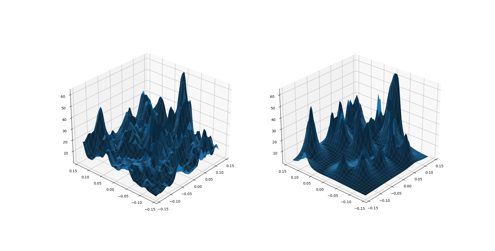
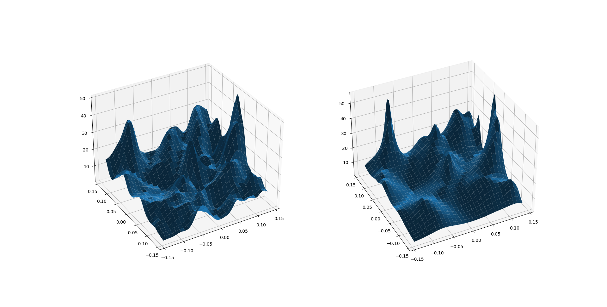
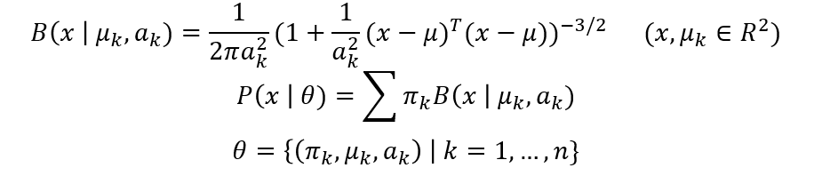
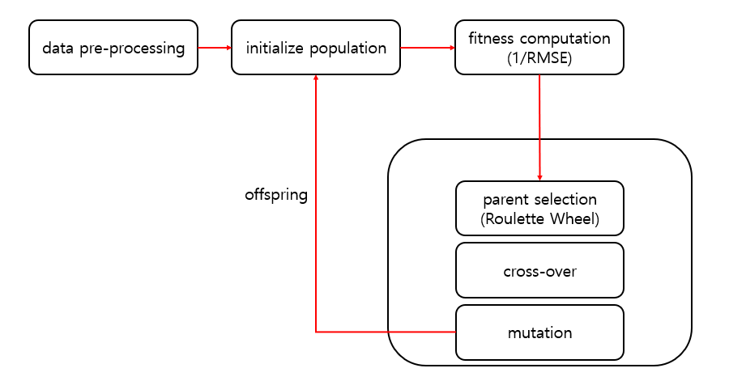

# surface-decomposition
Code and explanation for research project about surface decomposition using genetic algorithm.

This project aims to decompose earth surface data with basis function as bell-shaped function using genetic optimization algorithm.


## How to run
```
python decomposition.py --data_path <nc_file>
ex) python decomposition.py --data_path ./data/ETOPO1_Ice_g_gdal.nc
```

## Experiment results
Left: raw data / Right: decomposed data



## Methodology
Description of bell-shaped function, parameter, and decomposed surface function below.


Description of genetic optimization algorithm below.

